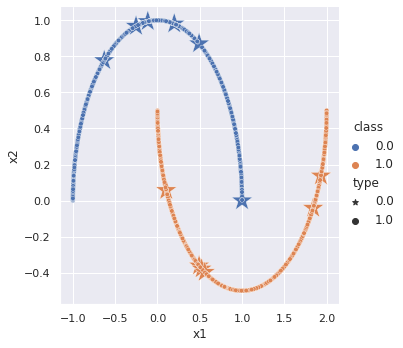
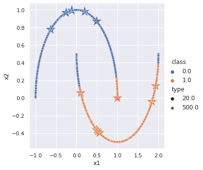
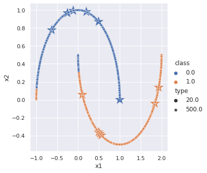

# Implementation of Meta Pseudo Labels
 

## Summary

The main idea behind pseudo labels is to take full advantage of a pre-trained teacher network to teach a student network under lack of labeled data. A teacher network generates the so-called "pseudo labels" from large amounts of unlabeled data which a student network then learns from in a supervised manner. An issue with this approach, however, is that a teacher network is bound to make few mistakes along the way by incorrectly labeling data and thus resulting in the student learning the mistakes as well. Meta pseudo labels [1] tackles this challenge by updating the teacher based on the student's performance on labeled data. A student performing poorly on labeled data can serve as a signal for the teacher to improve and generate better labels.

### Results on the Two Moons dataset

               

### TODOs
* More experimental results using larger datasets and models

## References

[1] Pham, Hieu, Zihang Dai, Qizhe Xie, and Quoc V. Le. "Meta pseudo labels." In Proceedings of the IEEE/CVF Conference on Computer Vision and Pattern Recognition, pp. 11557-11568. 2021.
